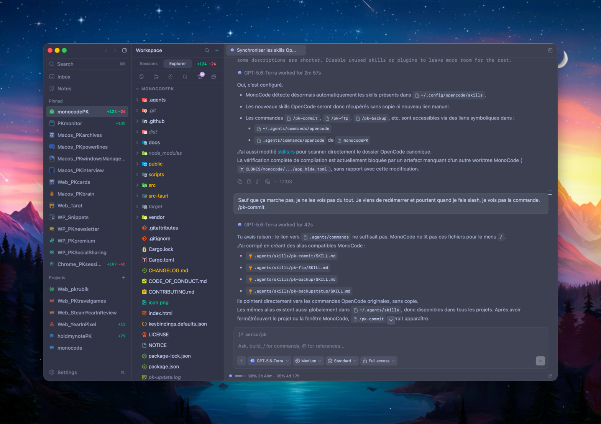

<!-- MONOCODE-PK-START -->
<p align="center"></p>

# MonoCode PK

[🇫🇷 PK (FR)](#monocode-pk) · [🇬🇧 README officiel (EN) ci-dessous](#monocode)

Fork personnel de [MonoCode](https://github.com/hardbeat920/monocode), maintenu via merge de l'amont — version **2026.09.17**.

<p align="center">
  
</p>

## 🎯 Pourquoi ce fork

MonoCode PK garde **tout MonoCode officiel** (merge régulier de l'amont, `tauri.conf.json` identique → zéro conflit) et ajoute une couche personnelle : pilotage multi-providers réel, rail projets vivant, initialisation de projet en un clic, et une boucle de mise à jour à deux axes. Chaque réglage modifié porte un badge **PK** dans Settings.

| Domaine | MonoCode officiel | MonoCode PK |
|---|---|---|
| Providers directs | Claude, Codex, Cursor, Grok, OpenCode, Pi, omp, fx | + **Z.ai (GLM)**, **Xiaomi MiMo**, Zen, onglets OpenAI-compatibles |
| Quotas en footer | — | Vrais chiffres **CodexBar** : Codex, ZAI, OpenCode Go, MiMo… mode *Current chat* ou *Choose* |
| **Providers custom** | — | Endpoints OpenAI-compatibles (base URL + API key + **bouton Test**), routés via OpenCode |
| Image de fond | Chat uniquement | **Par panneau** : Chat / Workspace / Terminal, activables |
| Rail projets | Statique | **Glow paramétrable** sur les projets en travail + badge **« terminé — à vérifier »** quand l'agent a fini |
| Initialisation projet | — | Bouton **Initialize** : symlinks `.agent`/`.inspi`/templates, fichiers d'instructions, `.gitignore`, `VERSION`/`CHANGELOG.md` — jamais d'écrasement |
| Mises à jour | Updater binaire officiel | Deux axes : amont **+ branche PK GitHub**, **dialog in-app stylé** avec liste des commits, un clic = merge + build + relance |
| Environnement de dev | — | Variante **dev isolée** (`build:pk:dev`) : je code/tue/relance sans toucher à ta version quotidienne |

## ✨ En détail

### Rail projets & agents
- Titre du projet en travail balayé d'une lumière dont la **couleur se choisit** (Theme, Amber, Emerald, Sky, Violet, Pink, Red).
- Quand un agent **termine** pendant que tu es ailleurs : pastille ✓ émeraude « finished — needs review » sur le projet, effacée quand tu ouvres la session.
- Commits non poussés `↑n` par projet, bouton dépôt avec le **logo officiel GitHub** (ou GitLab selon le remote).
- Cycle global des onglets chat/terminal (⌘⌥ flèches), carte des agents en cours.

### Notes & Explorer
- **Onglet Notes par projet** à côté de Sessions / Explorer / Changes : les notes du projet en cours, recherche, création rapide, suppression, et ouverture dans la vue Notes complète centrée sur la note.
- **Initialize project** (baguette ✨) : crée les liens symboliques de tes templates/skills et expose `AGENT.md`, `CLAUDE.md`, etc. à la racine — sources et options éditables dans *Settings > Skills*.
- Bouton **Changes masquable** (l'onglet Source Control fait déjà le travail) et **accent PK** sur les boutons Reveal / Initialize.

### Usage & providers
- Footer usage : **Current chat** (suit la conversation) ou **Choose** (coche Codex, ZAI, OpenCode Go, Xiaomi MiMo… affichés en permanence, quel que soit le chat ouvert).
### Apparence
- Presets **Dracula** et **Catppuccin** complets : Latte (bascule en light), Frappé, Macchiato, Mocha — palette officielle.
- Teinte/saturation du thème réglables, fonds de sidebar personnalisés, transparence.
- Icône app custom (ton `iconique.png`), About en tête de General, nouveautés officielles et PK côte à côte, badges PK sur les réglages du fork.

### Terminal & raccourcis
- Position du dock terminal configurable (bottom/right/left/top/tab), vrais onglets, indicateur d'activité.
- Page **Keybindings** dédiée : capture native des touches, détection de conflits, menu reconstruit à la volée.

## 🧠 Utilisation

- `scripts/sync-pk-update.sh` — synchronise l'amont (fetch + merge), build, relance l'app ; dialog intégré avec bouton « Plus tard » et liste des commits en retard.
- `npm run build:pk:dev` — build la variante **dev** (`/Applications/MonoCodePK-Dev.app`, identifiant `com.monocode.pk.dev`) : données et permissions isolées, cohabite avec la version quotidienne pour valider les nouveautés sans tuer MonoCode PK. Le « Check for Updates » de chaque variante reconstruit et relance sa propre variante.

## ⚙️ Réglages
- Tout se règle dans Settings : thème, raccourcis, position du dock terminal, footer usage (*Current chat* / *Choose*), glow des projets en travail, options Explorer, initialisation de projet (liens, `.gitignore`, fichiers metadata). Les options modifiées par rapport à l'officiel portent un badge PK.

## 📦 Build & Package

- `npm run build:pk` — build release avec overlay de branding PK (`tauri.conf.json` identique à l'amont, zéro conflit de merge), installe `/Applications/MonoCodePK.app` (identifiant dédié `com.monocode.pk`, signature Apple Development stable).

## 📋 Historique

- Versions PK détaillées : sections `[2026.09.x]` dans le [CHANGELOG](CHANGELOG.md) ; le reste suit les releases officielles.

## 🔗 Liens

- [MonoCode officiel](https://github.com/hardbeat920/monocode) · branche `perso/pk` = ce fork · branche `main` = miroir de l'amont.

<!-- MONOCODE-PK-END -->


<p align="center">
  
</p>

<h1 align="center">MonoCode</h1>

<p align="center">
  <strong>A desktop UI for your coding agents.</strong>
</p>

<p align="center">
  
</p>

Works with your subscriptions on Claude Code, Codex, Cursor, Grok Build, OpenCode, Pi, omp, and fx. If they’re installed and logged in, MonoCode can run them. Tabs are sessions. The composer is the input. MonoCode does not sell tokens.

## Install

> Install and log in to at least one provider first:
>
> - [Claude Code](https://claude.com/product/claude-code) - `claude auth login`
> - [Codex](https://developers.openai.com/codex/cli) - `codex login`
> - [Cursor CLI](https://cursor.com/cli) - `agent login`
> - [Grok Build](https://docs.x.ai/build/overview) - `curl -fsSL https://x.ai/cli/install.sh | bash` then `grok login`
> - [OpenCode](https://opencode.ai) - `opencode auth login`
> - [Pi](https://pi.dev/) - `npm install -g @earendil-works/pi-coding-agent`
> - [omp](https://omp.sh) - `curl -fsSL https://omp.sh/install | sh`
> - [fx](https://fx.sh) - `curl -fsSL https://fx.sh/setup.sh | bash` then `fx login`

macOS (Apple Silicon): download [MonoCode.dmg](https://dl.usemono.dev/MonoCode.dmg), open it, drag MonoCode to Applications.

Linux (x86_64): download the `.deb` or AppImage from [GitHub Releases](https://github.com/hardbeat920/monocode/releases/latest). Install the `.deb` with `sudo apt install ./MonoCode_*.deb`, or make the AppImage executable with `chmod +x MonoCode_*.AppImage` and run it directly.

Windows (x86_64): download the NSIS installer from [GitHub Releases](https://github.com/hardbeat920/monocode/releases/latest) and run it.

## Some notes

This is very early and you should expect bugs.

Small, focused pull requests are welcome. Anything large is worth an issue first - see [CONTRIBUTING.md](CONTRIBUTING.md).

## Build from source

Supports macOS, Linux, and Windows.

Need Node.js 20+ and a current stable Rust toolchain. On Linux, ensure standard Tauri prerequisites are installed (e.g. `libwebkit2gtk-4.1-dev`, `libgtk-3-dev`, `libsoup-3.0-dev`, `libjavascriptcoregtk-4.1-dev`). On Windows, the installer bootstraps the [WebView2](https://developer.microsoft.com/microsoft-edge/webview2/) runtime when it is missing.

```bash
npm install
npm run tauri dev
```

### Ubuntu / Debian packages

On an Ubuntu/Debian workstation, the repository can install the native Tauri prerequisites and build distributable Linux packages directly:

```bash
npm run setup:linux:deb
npm ci
npm run build:linux
```

The Linux build emits `.deb` and AppImage bundles under `target/release/bundle/`.
Tauri loads `src-tauri/tauri.linux.conf.json` automatically for Linux development and builds.

### Windows packages

```bash
npm ci
npm run build:windows
```

The Windows build emits an NSIS installer under `target/release/bundle/nsis/`.
Tauri loads `src-tauri/tauri.windows.conf.json` automatically for Windows development and builds.

## License

[MIT](LICENSE). Provider names and logos are trademarks of their owners - see [NOTICE](NOTICE).
